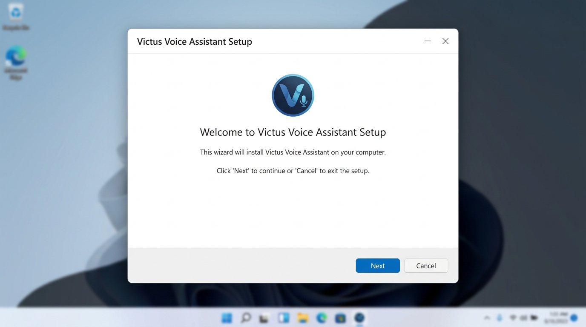
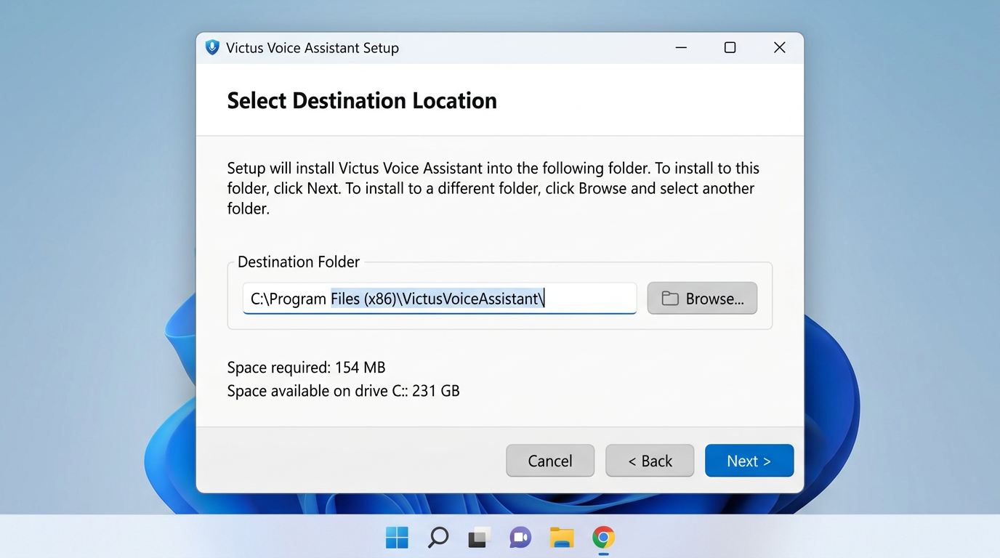
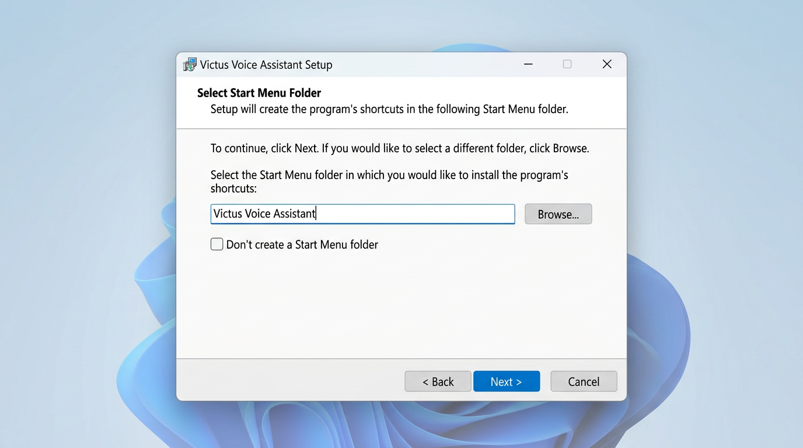
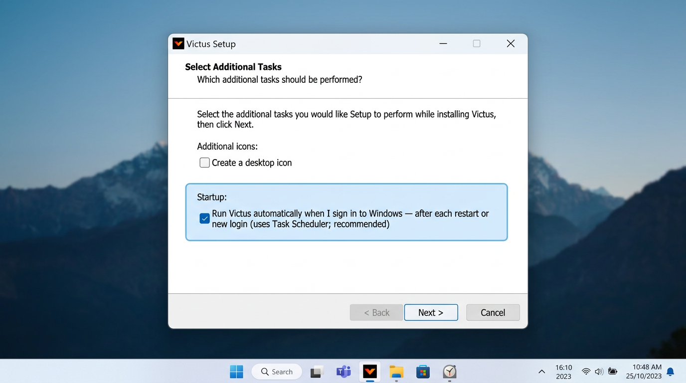
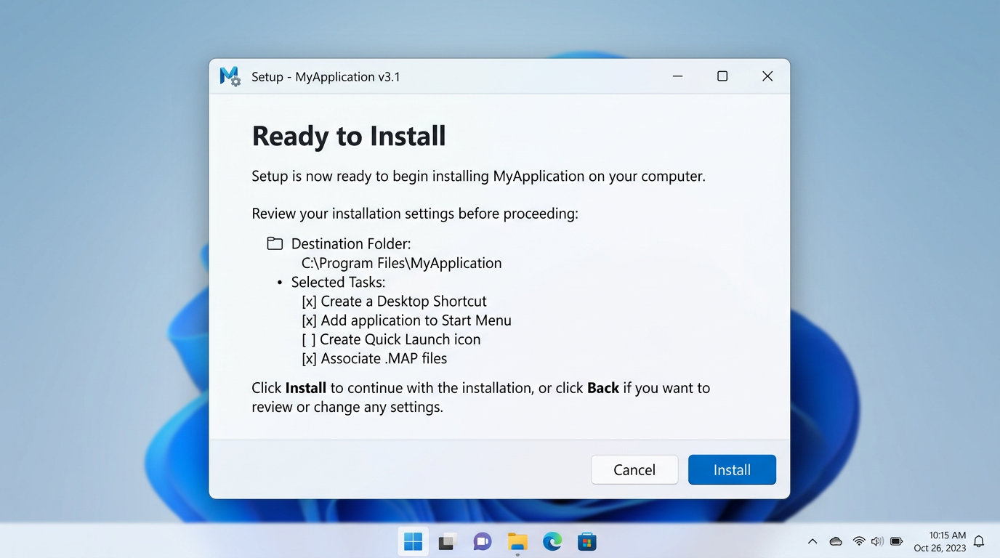
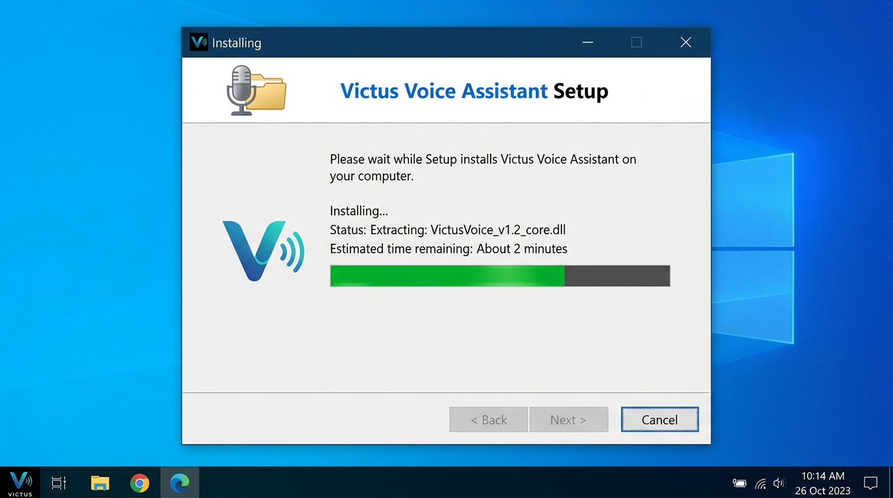
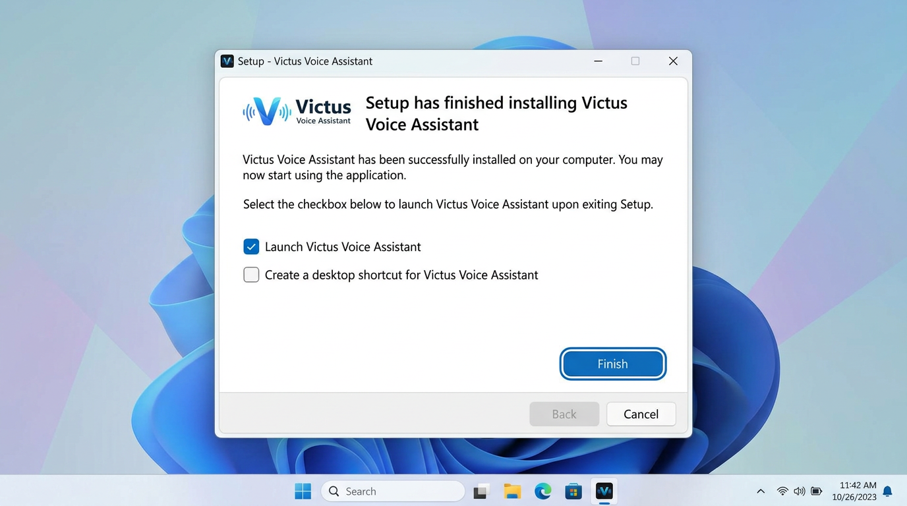

# Victus Voice Assistant

Windows startup voice assistant that speaks a daily briefing after login:

- Time-aware greeting
- Current weather for your city
- Top India news headlines
- Edge neural TTS with SAPI fallback
- Optional bottom-right overlay UI

Designed for **automatic run at Windows sign-in** via Task Scheduler.

---

## How it is organized

- **`morning_briefing.py`** (repo root) is the stable entry script.
- Implementation lives in the **`victus/`** package (`import victus...`).
- **`config.json`** must live next to the entry you run: the **project root** when using `morning_briefing.py`, or the **same folder as `VictusMorningBriefing.exe`** when using the built executable.

---

## Features

- **Auto-start on login** via scheduled task scripts
- **Boot reliability flow**
  - Scheduled task startup delay (`DelayAfterLogonSeconds`)
  - Internet readiness checks
  - Post-network audio stabilization delay
  - Extra autostart-only delays (`VICTUS_AUTOSTART=1` path)
- **Speech engine options**
  - Edge neural (`tts_engine: edge`)
  - Windows SAPI fallback (`tts_engine: sapi`)
- **Overlay UI (Windows, optional)**
  - Countdown during startup delay
  - Network wait state
  - Speaking transcript + waveform
  - Footer line **Built by** *your name* (set `overlay_credits_name` in `config.json`; the words **Built by** stay fixed)
  - Stop / close controls
- **Operational logging**
  - `%LOCALAPPDATA%\VictusVoiceAssistant\briefing.log`

---

## Project structure

| Path | Role |
|------|------|
| `morning_briefing.py` | Thin entrypoint/orchestrator |
| `victus/runtime_support.py` | Config loading, logging, HTTP helpers, autostart env detection |
| `victus/startup_gate.py` | Login delay, internet wait, mutex check, post-network delay |
| `victus/briefing/` | Weather/news fetch and briefing segment building |
| `victus/speech/` | Edge + pygame playback, SAPI fallback |
| `victus/ui/` | Tk overlay process + parent controller |
| `victus/briefing_content.py`, `victus/speech_engines.py`, `victus/overlay_ui.py` | Compatibility re-export shims |
| `config.example.json` | Safe template; copy to `config.json` locally |
| `setup_login_task.ps1` | Registers the logon task with delay |
| `launch_at_logon.ps1` | Launcher used by the task (sets `VICTUS_AUTOSTART=1`) |
| `launch_exe_at_logon.cmd` | Same idea for the built `.exe` (copy `dist` files together) |
| `remove_login_task.ps1` | Removes scheduled task |
| `VictusMorningBriefing.spec` | PyInstaller definition for a one-file `.exe` |
| `build_windows.ps1` | Builds `dist\VictusMorningBriefing.exe` |
| `installer\VictusSetup.iss` | Inno Setup script for `Output\VictusVoiceAssistant_Setup.exe` |
| `build_installer.ps1` | Builds `.exe` then runs Inno Setup (install Inno Setup 6 first) |
| `requirements-build.txt` | Build-only dependency (`pyinstaller`) |
| `TROUBLESHOOTING.txt` | Boot/runtime troubleshooting guide |

---

## Requirements

- Windows 10/11
- Python 3.10+
- Internet connection (weather/news + Edge TTS)

Install:

```powershell
python -m venv .venv
.\.venv\Scripts\Activate.ps1
python -m pip install -r requirements.txt
```

---

## Configuration

1. Copy template:

```powershell
copy config.example.json config.json
```

2. Edit `config.json`.

### Config keys (reference)

| Key | Purpose |
|-----|---------|
| `show_overlay_ui` | Enable/disable bottom-right overlay window |
| `overlay_wave_height` | Speaking waveform circle diameter (px) |
| `overlay_window_width` | Overlay window width (px) |
| `overlay_window_height` | Overlay window height (px) |
| `overlay_text_columns` | Transcript width in character columns |
| `overlay_text_height_lines` | Transcript height in lines |
| `overlay_code_font_size` | Transcript font size |
| `overlay_child_process_ready_seconds` | Wait after spawning overlay process |
| `overlay_credits_name` | Your name after **Built by** in the overlay footer (empty = footer shows only **Built by**) |
| `city` | Weather city name |
| `news_feed_url` | RSS URL for headlines |
| `news_count` | Number of headlines |
| `pre_overlay_delay_seconds` | Delay before overlay for all runs |
| `autostart_extra_delay_seconds` | Extra pre-overlay delay when autostarted |
| `login_delay_seconds` | Countdown delay before startup gates continue |
| `internet_wait_max_seconds` | Max wait for internet |
| `internet_check_poll_seconds` | Poll interval for internet checks |
| `post_internet_delay_seconds` | Delay after internet becomes reachable |
| `autostart_post_internet_extra_seconds` | Extra post-internet delay when autostarted |
| `logon_singleton_mutex` | Optional mutex to avoid duplicate logon starts |
| `tts_engine` | `edge` or `sapi` |
| `tts_voice` | Edge `ShortName` (or SAPI hint path if using SAPI) |
| `edge_speaking_rate`, `edge_volume`, `edge_pitch` | Edge TTS tuning |
| `edge_playback_mode` | `chunked` or `continuous` |
| `sapi_voice_hint` | SAPI voice hint (e.g. `Zira`) |
| `tts_rate`, `tts_volume` | SAPI speech settings |
| `pause_between_sections_seconds` | Pause between section clips |
| `greeting_name` | Optional name for greeting |
| `briefing_language` | Briefing language (`en` / `hi`) |

---

## Build a Windows `.exe` (for sharing)

On a Windows machine with Python 3.10+:

```powershell
python -m venv .venv
.\.venv\Scripts\Activate.ps1
python -m pip install -r requirements.txt -r requirements-build.txt
powershell -ExecutionPolicy Bypass -File .\build_windows.ps1
```

Output: **`dist\VictusMorningBriefing.exe`**. The build script also copies **`config.example.json`** and **`launch_exe_at_logon.cmd`** into `dist\` for convenience.

### Sharing with non-technical users (no code, no Notepad)

- The **`.exe` already includes** Python and libraries (nothing extra to install from the web except normal Windows updates).
- On **first run**, if there is **no** `config.json` next to the `.exe`, a **setup window** opens: name (for “Built by …”), city, voice, language, etc. Saving creates **`config.json`** in that same folder automatically.
- To **change settings later**, run **`VictusMorningBriefing.exe --setup`** (e.g. create a shortcut whose target is `"C:\Path\VictusMorningBriefing.exe" --setup`).
- **Startup at login:** use **`launch_exe_at_logon.cmd`** as the scheduled task action (or the Python `setup_login_task.ps1` flow from source). Or run the `.exe` directly if you do not need autostart-only delays.

### Windows installer wizard (`VictusVoiceAssistant_Setup.exe`)

1. Install **[Inno Setup 6](https://jrsoftware.org/isinfo.php)** on your PC (default options are fine).
2. From the project folder:

```powershell
powershell -ExecutionPolicy Bypass -File .\build_installer.ps1
```

This runs `build_windows.ps1`, then compiles **`installer\VictusSetup.iss`**.

3. Share **`Output\VictusVoiceAssistant_Setup.exe`**. End users run it like any normal Windows installer.

The installer puts files under **`%LocalAppData%\Programs\VictusVoiceAssistant`** (no administrator rights required by default). **`config.json`** is created in that folder when they first run the app or complete the in-app setup wizard.

#### Installer screens (step by step)

These images match the **Inno Setup 6** “modern” wizard defined in **`installer\VictusSetup.iss`**. They are **illustrative mockups** of each page (wording and options are the same as in the real installer).

| Step | What you do |
|------|-------------|
| 1 | Welcome — click **Next**. |
| 2 | **Select Destination Location** — default is fine (`…\VictusVoiceAssistant` under your user profile). Click **Next**. |
| 3 | **Select Start Menu Folder** — default is fine. Click **Next**. |
| 4 | **Select Additional Tasks** — under **Startup**, leave **“Run Victus automatically when I sign in to Windows…”** **checked** (default) so the app runs after each restart/sign-in via Task Scheduler. Optionally enable **Create a desktop icon**. Click **Next**. |
| 5 | **Ready to Install** — click **Install**. |
| 6 | **Installing** — wait for the progress bar. |
| 7 | **Finished** — leave **“Launch Victus Voice Assistant”** checked if you want to open the app now. Click **Finish**. |

**1 — Welcome**



**2 — Destination folder**



**3 — Start Menu folder**



**4 — Additional tasks (startup at sign-in — default ON)**

This is the screen with the **default-checked** option to run Victus after every Windows sign-in (restart or login).



**5 — Ready to install**



**6 — Installing**



**7 — Finished**



---

## Run manually

Normal run:

```powershell
.\.venv\Scripts\python.exe .\morning_briefing.py
```

Fast local test (skip startup waits):

```powershell
$env:VICTUS_NO_DELAY='1'
.\.venv\Scripts\python.exe .\morning_briefing.py
```

List available voices:

```powershell
.\.venv\Scripts\python.exe .\morning_briefing.py --list-voices
```

Open the graphical setup again (same as the built-in first-run wizard):

```powershell
.\.venv\Scripts\python.exe .\morning_briefing.py --setup
```

---

## Enable auto-run at login

Register task:

```powershell
powershell -ExecutionPolicy Bypass -File .\setup_login_task.ps1
```

Remove task:

```powershell
powershell -ExecutionPolicy Bypass -File .\remove_login_task.ps1
```

Task name: `VictusMorningBriefing`

Notes:

- `setup_login_task.ps1` sets a startup delay (`DelayAfterLogonSeconds`, currently 45).
- Task runs `launch_at_logon.ps1`, which sets `VICTUS_AUTOSTART=1` and starts `morning_briefing.py`.

---

## Troubleshooting

- Log file: `%LOCALAPPDATA%\VictusVoiceAssistant\briefing.log`
- Full guide: `TROUBLESHOOTING.txt`

---

## Security notes

Do **not** commit local/personal runtime files:

- `config.json`
- `.venv/`
- local logs

Use `config.example.json` as the shared template.
